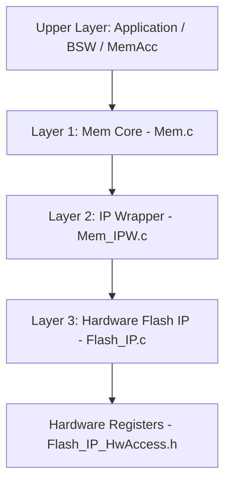

# AUTOSAR CP MEMORY DRIVER (MCAL) - STM32F401RE

Dự án phát triển và tích hợp Driver Bộ nhớ chuẩn **AUTOSAR CP (Memory Driver - Mem)** trên vi điều khiển **STM32F401RE (ARM Cortex-M4)**, bao gồm công cụ sinh cấu hình GUI (Code Generator), Kiến trúc Driver 3 tầng và Khung kiểm thử toàn diện **54 Testcases** kết hợp **Giao diện Dòng lệnh Tương tác UART (Interactive CLI)**.

---

## MỤC LỤC
1. [Kiến trúc Driver 3 Tầng](#1-kiến-trúc-driver-3-tầng)
2. [Flash Memory Map STM32F401RE](#2-flash-memory-map-stm32f401re)
3. [Bộ Testcase Tự động (54 Testcases)](#3-bộ-testcase-tự-động-54-testcases)
4. [Chế độ Manual Interactive CLI](#4-chế-độ-manual-interactive-cli)
5. [Hardware Memory Inspection via STM32CubeProgrammer](#5-hardware-memory-inspection-via-stm32cubeprogrammer)
6. [Hướng dẫn Cài đặt và Vận hành](#6-hướng-dẫn-cài-đặt-và-vận-hành)
7. [Cấu trúc Thư mục Dự án](#7-cấu-trúc-thư-mục-dự-án)

---

## 1. KIẾN TRÚC DRIVER 3 TẦNG

Driver tuân thủ kiến trúc phân lớp theo đặc tả AUTOSAR CP SWS Memory Driver:



* **Layer 1 - `Mem.c / Mem.h` (AUTOSAR Core Layer)**:
  - Quản lý Job Context và Job State Machine (`Mem_JobResults`, `Mem_JobContext`).
  - Xử lý Parameter Validation và báo cáo lỗi qua `Det_ReportError()`.
  - Phân tách dữ liệu thành từng Chunk trong hàm `Mem_MainFunction()`.
* **Layer 2 - `Mem_IPW.c / Mem_IPW.h` (IP Wrapper Layer)**:
  - Cầu nối đồng bộ chuyển đổi kiểu dữ liệu giữa AUTOSAR Mem và Hardware IP.
  - Phân giải địa chỉ tuyến tính thành Physical Sector ID.
* **Layer 3 - `Flash_IP.c / Flash_IP_HwAccess.h` (Hardware Flash IP Driver)**:
  - Thao tác trực tiếp với thanh ghi phần cứng Flash STM32 (`FLASH_KEYR`, `FLASH_SR`, `FLASH_CR`).
  - Thực thi quy trình Flash Unlock sequence, Sector Erase (SER), Word Programming (PG) và Clear Hardware Error Flags.

---

## 2. FLASH MEMORY MAP STM32F401RE (TỔNG 512 KB)

Flash STM32F401RE có kiến trúc Single-Bank chia thành 8 Sector:

| Sector | Kích thước | Dung lượng (Bytes) | Dải địa chỉ | Vai trò trong Dự án |
| :---: | :---: | :---: | :---: | :--- |
| **Sector 0** | 16 KB | 16,384 B | `0x08000000 - 0x08003FFF` | Protected: Vector Table & Startup Code |
| **Sector 1** | 16 KB | 16,384 B | `0x08004000 - 0x08007FFF` | Protected: Application Firmware |
| **Sector 2** | 16 KB | 16,384 B | `0x08008000 - 0x0800BFFF` | Protected: Application Firmware & C Runtime |
| **Sector 3** | 16 KB | 16,384 B | `0x0800C000 - 0x0800FFFF` | Safe Test Region: Small Sector (16 KB) |
| **Sector 4** | 64 KB | 65,536 B | `0x08010000 - 0x0801FFFF` | Safe Test Region: Medium Sector (64 KB) |
| **Sector 5** | 128 KB | 131,072 B | `0x08020000 - 0x0803FFFF` | Safe Test Region: Large Sector (128 KB) |
| **Sector 6** | 128 KB | 131,072 B | `0x08040000 - 0x0805FFFF` | Safe Test Region: Large Sector (128 KB) |
| **Sector 7** | 128 KB | 131,072 B | `0x08060000 - 0x0807FFFF` | Default Test Region: Large Sector (128 KB) |

---

## 3. BỘ TESTCASE TỰ ĐỘNG (54 TESTCASES)

Khung kiểm thử runtime gồm 9 nhóm testcase với định dạng ID 3 chữ số:

```text
================ AUTOSAR MEM TEST MENU ================
  1 - INIT Group (5 Cases: 101 -> 105)
  2 - DET Group (5 Cases: 201 -> 205)
  3 - STATUS Group (5 Cases: 301 -> 305)
  4 - READ Group (5 Cases: 401 -> 405)
  5 - WRITE Group (6 Cases: 501 -> 506)
  6 - ERASE Group (6 Cases: 601 -> 606)
  7 - BLANKCHECK Group (6 Cases: 701 -> 706)
  8 - JOB Group (11 Cases: 801 -> 811)
  9 - BOUNDARY Group (5 Cases: 901 -> 905)
  A - RUN ALL 54 TESTCASES
  M - [CHE DO BANG TAY] Interactive Manual CLI
=======================================================
```

### Chi tiết 9 nhóm Test:
* **INIT (101 - 105)**: Kiểm tra Driver Initialization, Version Info (`Mem_GetVersionInfo`) và De-initialization (`Mem_DeInit`).
* **DET (201 - 205)**: Parameter Validation và phát hiện lỗi phát triển (NULL pointer, Out-of-bounds Address, Length = 0, Invalid Instance ID).
* **STATUS (301 - 305)**: Job State Machine transitions (`MEM_JOB_OK`, `MEM_JOB_PENDING`, `MEM_JOB_FAILED`).
* **READ (401 - 405)**: Đọc dữ liệu từ Vector Table Sector 0, kiểm tra tính toàn vẹn bộ đệm và Job conflict rejection.
* **WRITE (501 - 506)**: Asynchronous Write xuống Sector 3-7, Read-Back Verification đối chứng dữ liệu.
* **ERASE (601 - 606)**: Physical Sector Erase về `0xFF`, Sector Address Alignment validation.
* **BLANKCHECK (701 - 706)**: Kiểm tra vùng nhớ Blank (`MEM_JOB_OK`) và Non-Blank (`MEM_INCONSISTENT`).
* **JOB (801 - 811)**: Single Job Queue Management (`SWS_Mem_00057`), Job Cancellation (`Mem_PropagateError`), Non-supported Optional Services.
* **BOUNDARY (901 - 905)**: Neighbor Sector Snapshot Isolation (xác minh việc Erase sector mục tiêu không làm thay đổi dữ liệu sector liền kề), Boundary Edge Read/Write.

---

## 4. CHẾ ĐỘ MANUAL INTERACTIVE CLI

Khi nhấn phím `M` trên Menu chính, hệ thống kích hoạt Command Shell:

```text
[MANUAL CLI MENU]
  1 - Doc Flash (Mem_Read) theo dia chi & do dai tuy y
  2 - Ghi Flash (Mem_Write) voi Pattern tuy y
  3 - Xoa Sector Flash (Mem_Erase)
  4 - Kiem tra trong (Mem_BlankCheck)
  5 - Test tiem loi DET (Stress/Negative Test)
  0 - Quay lai Menu chinh
Chon chuc nang (0-5): 
```

### Smart Presets:
* **Address Selection**: Gõ `0` (Sector 0), `3` (Sector 3), `7` hoặc `Enter` (chọn mặc định Sector 7 `0x08060000`), `C` (Custom Address).
* **Length Selection**: Gõ `1` (4B), `2` hoặc `Enter` (16B), `3` (32B), `4` (64B), `C` (Custom Length).
* **Pattern Selection**: Gõ `1` hoặc `Enter` (Pattern `0x31` ASCII sequential), `2` (`0xAA` Checkerboard), `3` (`0x55` Inverted bits), `C` (Custom Pattern).

### Kết quả Hex Dump 16 cột + ASCII View:
```text
Offset      00 01 02 03 04 05 06 07  08 09 0A 0B 0C 0D 0E 0F  ASCII
-------------------------------------------------------------------------
0x0800C000  31 32 33 34 35 36 37 38  39 3A 3B 3C 3D 3E 3F 40  123456789:;<=>?@
0x0800C010  41 42 43 44 45 46 47 48  49 4A 4B 4C 4D 4E 4F 50  ABCDEFGHIJKLMNOP
0x0800C020  51 52 53 54 55 56 57 58  59 5A 5B 5C 5D 5E 5F 60  QRSTUVWXYZ[\]^_`
0x0800C030  61 62 63 64 65 66 67 68  69 6A 6B 6C 6D 6E 6F 70  abcdefghijklmnop
```

---

## 5. HARDWARE MEMORY INSPECTION VIA STM32CUBEPROGRAMMER

Xác thực trực tiếp nội dung Flash phần cứng song song với quá trình runtime:

1. Mở phần mềm **STM32CubeProgrammer**.
2. Cấu hình kết nối ST-LINK:
   - **Mode**: `Hot plug` (duy trì firmware đang chạy, không kích hoạt Hardware Reset).
   - Bấm **Connect**.
3. Tab **`Memory & File edition`**:
   - **Address**: `0x0800C000` (Sector 3) hoặc `0x08060000` (Sector 7).
   - **Size**: `0x100` hoặc `0x4000`.
   - **Data width**: Chọn `8-bit` (Byte view) hoặc `32-bit` (Word Little-Endian view).
4. Bấm **`Read`** để cập nhật trạng thái Flash theo thời gian thực.

---

## 6. HƯỚNG DẪN CÀI ĐẶT VÀ VẬN HÀNH

### Công cụ và Môi trường phát triển:
* Target Hardware: **STM32F401RE Nucleo-64** (ARM Cortex-M4).
* IDE & Toolchain: **STM32CubeIDE** ($\ge$ 1.14.0, GNU Tools for STM32).
* Hardware Debugger & Inspection: **STM32CubeProgrammer**.
* Serial Terminal: **Tera Term**, **PuTTY** hoặc **Hercules**.

### Cấu hình UART (USART2):
* **Baudrate**: `115200`
* **Data bits**: `8`
* **Parity**: `None`
* **Stop bits**: `1`
* **Flow Control**: `None`

---

## 7. CẤU TRÚC THƯ MỤC DỰ ÁN

```text
AUTOSAR_MEM/
├── Driver/
│   ├── include/                # Header files for Mem, Mem_IPW, Flash_IP
│   │   ├── Mem.h
│   │   ├── Mem_Types.h
│   │   ├── Mem_IPW.h
│   │   ├── Flash_IP.h
│   │   └── Flash_IP_HwAccess.h # Static inline hardware access functions
│   ├── src/                    # Implementation files
│   │   ├── Mem.c
│   │   ├── Mem_IPW.c
│   │   └── Flash_IP.c
│   └── Code_Generator/         # Python GUI Configurator
│       └── GUI/main_gui.py
├── Test/
│   ├── Core/                   # Test Engine & Interactive CLI
│   │   ├── TestManager.c
│   │   ├── TestManager.h
│   │   ├── Mem_Test_Traceability.md
│   │   └── DEBUGGING.md
│   ├── Testcase/               # 9 AUTOSAR Test Groups
│   │   ├── Init_Test.c
│   │   ├── Det_Test.c
│   │   ├── Status_Test.c
│   │   ├── Read_Test.c
│   │   ├── Write_Test.c
│   │   ├── Erase_Test.c
│   │   ├── BlankCheck_Test.c
│   │   ├── Job_Test.c
│   │   └── Boundary_Test.c
│   ├── Stub/                   # Stub modules (Det, MemAcc, SchM, Std)
│   └── Generated_File/         # Generated Configuration Headers
└── README.md                   # Project Documentation
```
